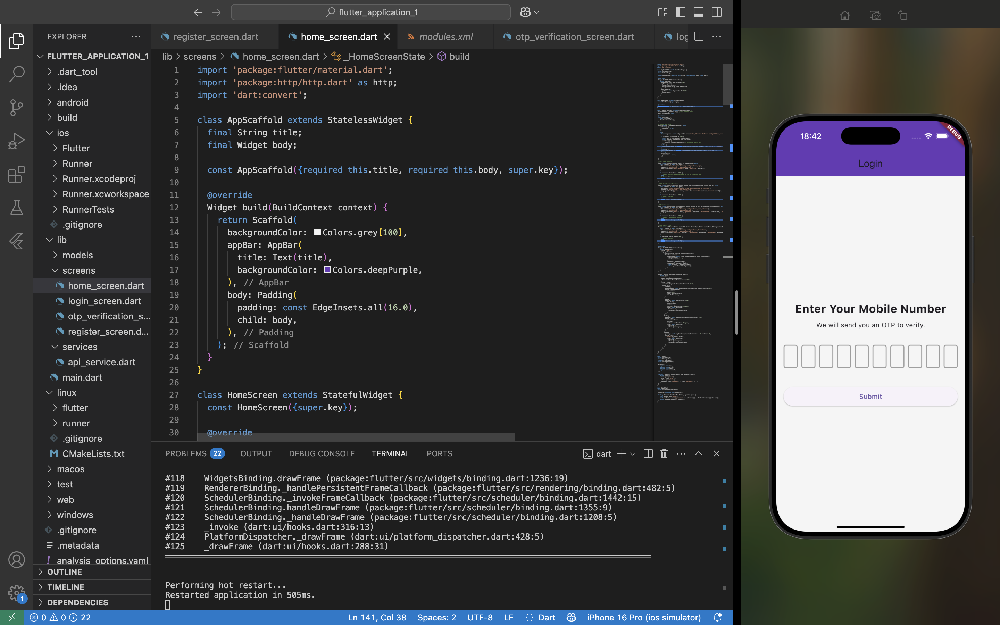
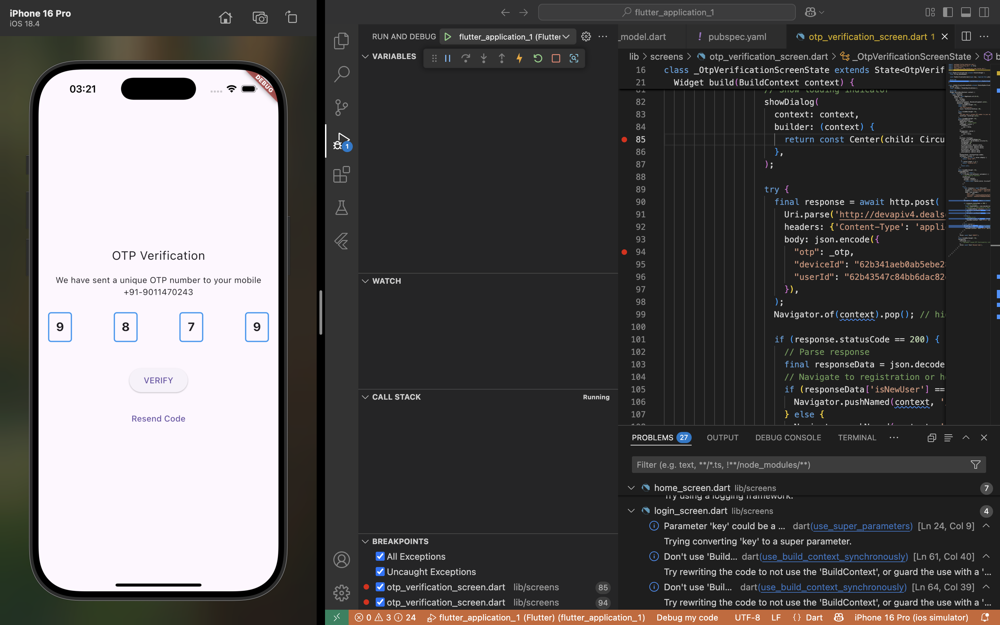
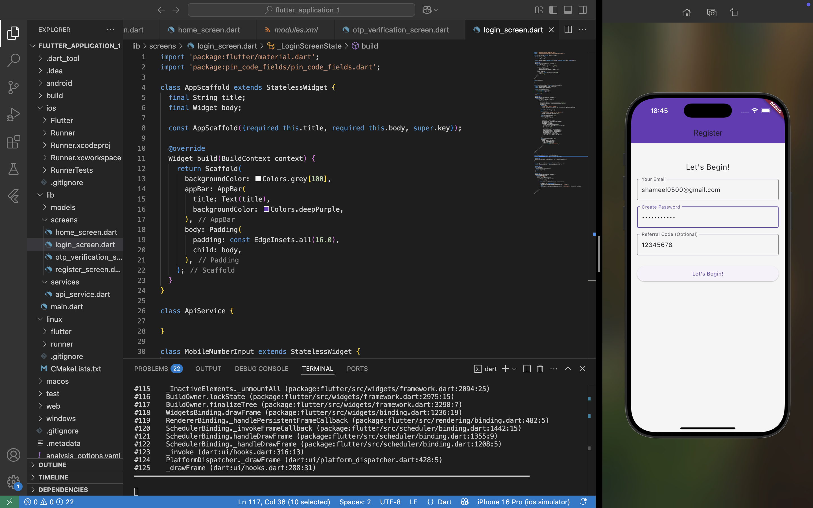
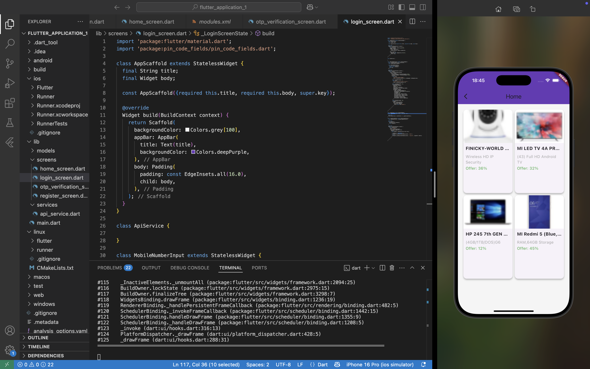

# 📱 Flutter Shopping App

A Flutter-based mobile app that allows users to log in with a phone number, verify with OTP, register new accounts, and browse categorized product deals.

## 🚀 Features

- 📱 Phone number login
- 🔐 OTP verification
- 👤 New user registration with referral code
- 🏠 Dynamic home screen with:
  - Product banners
  - Categories
  - Products grid with offers
- ⚙️ Device info submission
- ✅ API-integrated with real-time validation and response handling
- 🎨 Clean, consistent UI using custom `AppScaffold` and shared components

## 📸 Screenshots

| Login | OTP Verification | Registration | Home Screen |
|-------|------------------|--------------|--------------|
|  |  |  |  |

## 🧱 Tech Stack

- **Flutter** (UI)
- **Dart** (Programming Language)
- **HTTP** package for API integration
- **PinCodeFields** for OTP/mob input UI
- **REST API** backend
- **State Management**: `setState` (lightweight)

## 🔧 Setup Instructions

1. **Clone the repo**
```bash
git clone https://github.com/yourusername/flutter_shopping_app.git
cd flutter_shopping_app

lib/
├── main.dart
├── models/
│   └── product_model.dart
├── screens/
│   ├── login_screen.dart
│   ├── otp_verification_screen.dart
│   ├── register_screen.dart
│   └── home_screen.dart
├── services/
│   └── api_service.dart

